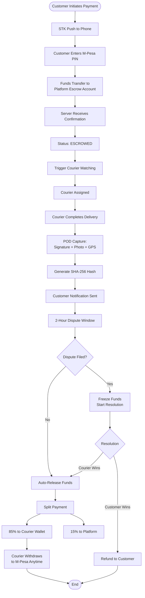

# SwiftSend Technical Diagrams

## Figure 1: System Architecture Diagram

---

## Figure 2: Address Resolution Process Flowchart

---

## Figure 3: Escrow Payment System Flowchart

---

## Figure 4: Courier Matching Algorithm Diagram

---

## Figure 5: Offline Operation Architecture

---

## Figure 6: Community Agent Network Topology

---

## Drawing Standards Applied

| Requirement                | Implementation                                                |
| -------------------------- | ------------------------------------------------------------- |
| Numbered figures           | Fig. 1 through Fig. 6                                         |
| Standard flowchart symbols | Rectangles (process), Diamonds (decisions), Ovals (start/end) |
| Clear directional arrows   | Mermaid auto-generates arrow directions                       |
| Legible text               | Markdown rendering ensures clarity                            |
| Separate sheets            | Each figure in its own section                                |
